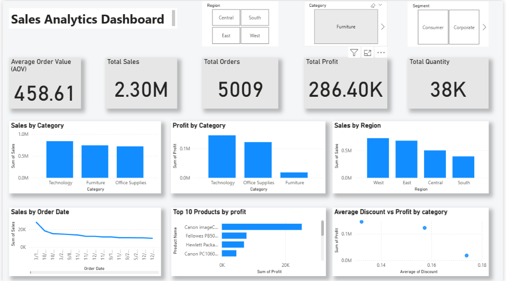

# Sales Analytics Dashboard

A data analytics project built using Python, Pandas, MySQL, and Power BI to analyze sales performance, profitability, customer segments, product performance, and regional trends using the Superstore dataset.

## Project Overview

This project covers the complete analytics workflow:

- Data cleaning and preparation using Python and Pandas
- Exploratory data analysis
- Business analysis using sales, profit, quantity, and discount metrics
- MySQL database integration
- Interactive Power BI dashboard
- Business insights and visual reporting

## Technologies Used

- Python
- Pandas
- MySQL
- Power BI
- Git & GitHub

## Key Metrics

- Total Sales: 2,297,200.86
- Total Profit: 286,397.02
- Total Quantity: 37,873
- Total Orders: 5,009
- Average Order Value: 458.61

## Key Insights

- Technology generated the highest sales and had a strong profit margin.
- Furniture generated substantial sales but had a significantly lower profit margin.
- The West region recorded the highest sales among all regions.
- Higher discounts showed a negative relationship with profit.
- Canon imageCLASS 2200 Advanced Copier was the highest-profit product.

## Power BI Dashboard

The dashboard includes:

- KPI cards
- Sales by Category
- Profit by Category
- Sales by Region
- Sales Trend Over Time
- Top 10 Products by Profit
- Average Discount vs Profit
- Region, Category, and Segment slicers

## Project Structure

SalesAnalytics/

├── data/                  # Dataset
├── images/                # Analysis visuals
├── powerbi/               # Power BI resources
├── sql/                   # SQL scripts
├── visuals/               # Dashboard and analysis screenshots
├── analysis.py            # Python data analysis
├── import_mysql.py        # MySQL data import
├── requirements.txt       # Python dependencies
├── .gitignore             # Git ignored files
└── README.md              # Project documentation

## Outcome

This project demonstrates practical skills in data cleaning, exploratory analysis, SQL database handling, business analysis, data visualization, and dashboard development.
